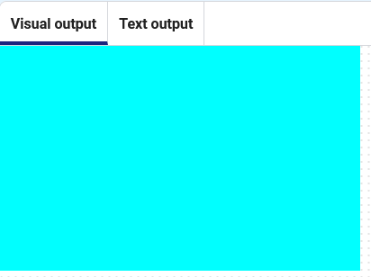

## Create a background

This project contains code to draw the sky as a blue rectangle.

➡️ Remove the black border from the background.

The border of a shape is called the **stroke**.

Click the **Run** button, and you should see a blue rectangle with a black border.

Add `no_stroke()` to the `setup` function to turn the stroke off for all shapes.

```python line_numbers="true" line_number_start="13" line_highlights="16"
def setup():
# Set up your game here
    size(400, 400)  # width and height of screen
    no_stroke()

```

## Now run your code



> [!TIP]
> Coordinates start from (x=0, y=0) in the top left-hand corner. This might be different to other coordinate systems you have used.
>
> If you see an alert "Execution interrupted" when you click stop on your program, don't be concerned. This just means the normal flow of the program was stopped.

Click the **Run** button again and check that you see a blue sky with no border around it.
