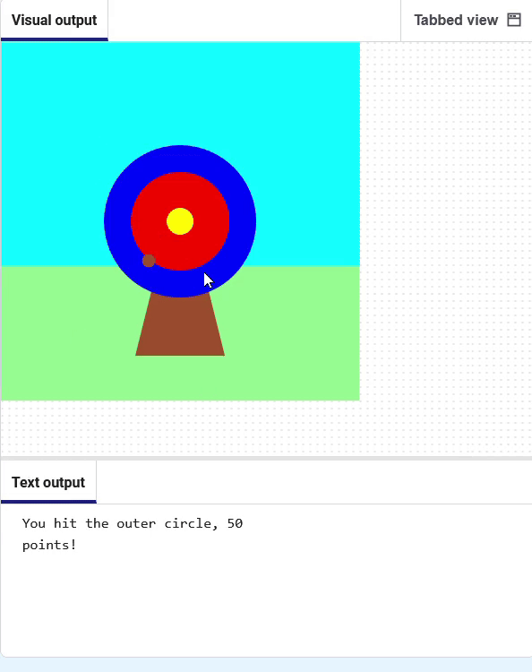

<h2 class="c-project-heading--task">Scoring points</h2>

--- task ---
➡️ If the arrow hit blue, print a message. 

--- /task ---

Comment out the line to print the 🎯 character.

Display a message **if** the `hit_colour`{:.language-python} is equal to the `outer` circle colour (blue). 

Notice that the code uses two equals signs `==`{:.language-python} to mean **equal to**.

--- code ---
---
language: python
line_numbers: true
line_number_start: 5
line_highlights: 8-9
---
  
# The mouse_pressed function goes here
def mouse_pressed():    
    # print('🎯')
    if hit_colour == Color('blue').hex:
        print('You hit the outer circle, 50 points!')
    
--- /code ---

**Test:** Click the **Run** button. Wait for the arrow to land on the blue circle, then click your left mouse button.

### Debugging

Make sure your code matches exactly and you have indented the code inside your `if` statement. 

If you changed the colour of your outer circle, you will need to replace `'blue'` with the name of the colour you have chosen.

