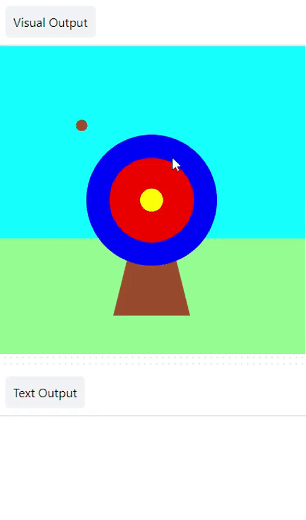

<h2 class="c-project-heading--task">More points</h2>

➡️ If the arrow hit red or yellow, print out a message.

<h2 class="c-project-heading--explainer">Follow these instructions</h2>

`elif` can be used to add more conditions to your `if` statement.

Display a different message if the arrow lands on the **inner** or **middle** circle.

--- code ---
---
language: python
line_numbers: true
line_number_start: 5
line_highlights: 10-13
---

# The mouse_pressed function goes here
def mouse_pressed():
    # print('🎯')
    if hit_colour == Color('blue').hex:
        print('You hit the outer circle, 50 points!')
    elif hit_colour == Color('red').hex:
        print('You hit the inner circle, 200 points!')
    elif hit_colour == Color('yellow').hex:
        print('You hit the middle, 500 points!')
--- /code ---

## Now run your code

### Debugging

+ Check that your indentation matches the example.

+ Make sure you have entered the correct colour names for your circles. 

+ Make sure you have used the `.hex` string for your circle colours.

Click the **Run** button, wait for the arrow to land on the target, then click and check that you score points.
