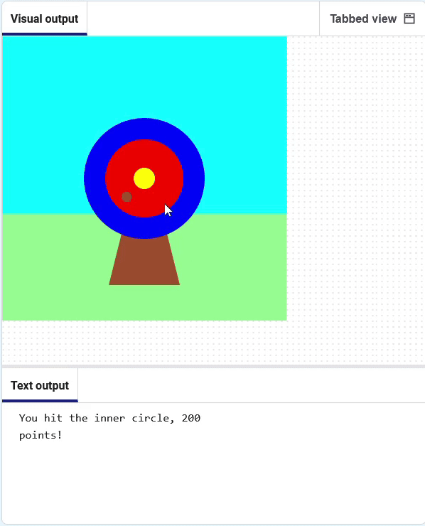

<h2 class="c-project-heading--task">Missing the target</h2>

--- task ---
➡️ If the arrow did not land anywhere on the target, display a message. 

--- /task ---
There is one more decision you need to make: what happens if the arrow does not land on any of the target circles?

To do this last check, you use `else`{:.language-python}.

--- code ---
---
language: python
line_numbers: true
line_number_start: 5
line_highlights: 14-15
---

# The mouse_pressed function goes here
def mouse_pressed():    
    # print('🎯')
    if hit_colour == Color('blue').hex:
        print('You hit the outer circle, 50 points!')
    elif hit_colour == Color('red').hex:
        print('You hit the inner circle, 200 points!')
    elif hit_colour == Color('yellow').hex:
        print('You hit the middle, 500 points!')
    else:   
        print('You missed! No points!')
--- /code ---

**Test:** Click the **Run** button. Fire the arrow in the grass or sky to see the miss message.

