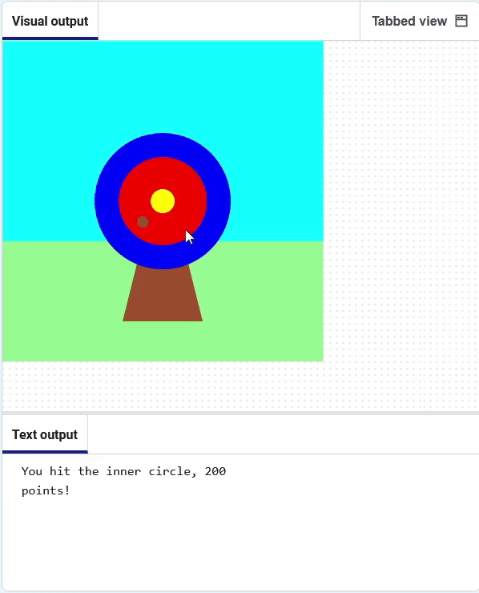

## Missing the target

➡️ If the arrow did not land anywhere on the target, display a message.

There is one more decision you need to make: what happens if the arrow does not land on any of the target circles?

To do this last check, you use `else`.

```python line_numbers="true" line_number_start="5" line_highlights="14-15"

# The mouse_pressed function goes here
def mouse_pressed():    
    # print('🎯')
    if hit_colour == Color('blue').hex:
        print('You hit the outer circle, 50 points!')
    elif hit_colour == Color('red').hex:
        print('You hit the inner circle, 200 points!')
    elif hit_colour == Color('yellow').hex:
        print('You hit the middle, 500 points!')
    else:   
        print('You missed! No points!')
```

## Now run your code



Click the **Run** button, fire the arrow into the grass or sky, and check that the miss message appears.
