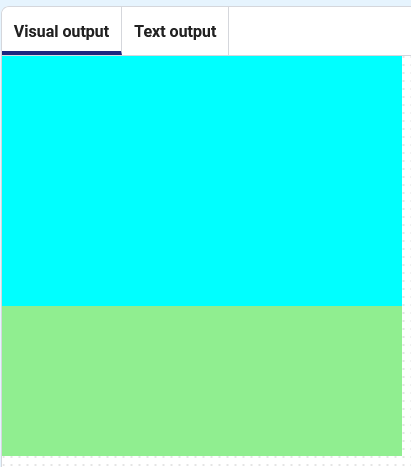

<h2 class="c-project-heading--task">Draw the grass</h2>

--- task ---

Add a second rectangle (`rect`{:.language-python}), coloured green and positioned lower in the view.

--- /task ---

--- code ---
---
language: python
line_numbers: true
line_number_start: 20
line_highlights: 24-35
---
def draw():
# Things to do in every frame
    fill('cyan')
    rect(0, 0, 400, 250)
    fill('lightgreen')
    rect(0, 250, 400, 150)
--- /code ---

**Test:** Click the **Run** button. You should see the full background.

### Debugging

Make sure your code matches exactly and you have indented the code inside the function correctly. 

