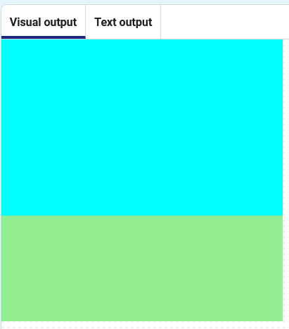

<h2 class="c-project-heading--task">Draw the grass</h2>

➡️ Draw a green rectangle to represent the grass.

<h2 class="c-project-heading--explainer">Follow these instructions</h2>

Add a second light green rectangle (`rect`) at the bottom of the background.

--- code ---
---
language: python
line_numbers: true
line_number_start: 19
line_highlights: 23-24
---
def draw():
# Things to do in every frame
    fill('cyan')
    rect(0, 0, 400, 250)
    fill('lightgreen')
    rect(0, 250, 400, 150)
--- /code ---

## Now run your code

Click the **Run** button. You should see the full background.

### Debugging

Make sure your code matches exactly and you have indented the code inside the function correctly. 

Confirm the observable result.
