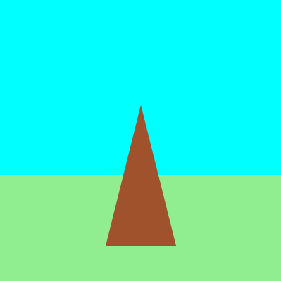

<h2 class="c-project-heading--task">Draw a stand</h2>

Your game needs a target to shoot arrows at.

<h2 class="c-project-heading--explainer">Follow these instructions</h2>

➡️ Draw a brown triangle to represent the target stand.

--- code ---
---
language: python
line_numbers: true
line_number_start: 23
line_highlights: 25-26
---
    fill('lightgreen')
    rect(0, 250, 400, 150)
    fill('sienna')
    triangle(150, 350, 200, 150, 250, 350)
--- /code ---

## Now run your code

Click the **Run** button. You should see the triangle.

{:width="400px"}

Confirm the observable result.
