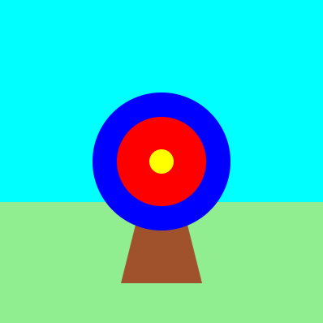

<h2 class="c-project-heading--task">Finish the target</h2>

➡️ Draw two more circles to complete the target.

<h2 class="c-project-heading--explainer">Follow these instructions</h2>

The archery target needs some more circles.

Add a smaller red and even smaller yellow circle.

--- code ---
---
language: python
line_numbers: true
line_number_start: 27
line_highlights: 29-32
---
    fill('blue')
    circle(200, 200, 170)
    fill('red')
    circle(200, 200, 110)
    fill('yellow')     
    circle(200, 200, 30)

--- /code ---

## Now run your code

Click the **Run** button. You should see the full target.

### Tip

You can find a list of all of the available colour names on [W3Schools](https://www.w3schools.com/colors/colors_names.asp){:target="blank"}. 

Confirm the observable result.
