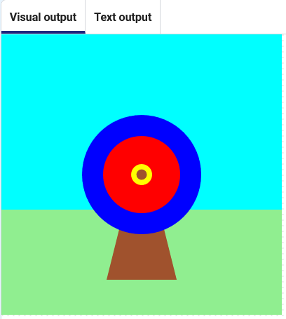

<h2 class="c-project-heading--task">Add an arrow</h2>

➡️ Create a function that draws a small circle to represent an arrow.

<h2 class="c-project-heading--explainer">Follow these instructions</h2>

The arrow will be drawn using a function.

Add a function to draw a sienna coloured circle at coordinates `200`, `200`.

--- code ---
---
language: python
line_numbers: true
line_number_start: 9
line_highlights: 10-14
---
# The shoot_arrow function goes here
def shoot_arrow():
    arrow_x = 200
    arrow_y = 200
    fill('sienna')
    circle(arrow_x, arrow_y, 15)

--- /code ---

Then call the function inside your `draw()` function.

--- code ---
---
language: python
line_numbers: true
line_number_start: 35
line_highlights: 37
---
    fill('yellow')
    circle(200, 200, 30)
    shoot_arrow()

--- /code ---

## Now run your code

Click the **Run** button and check that the arrow appears in the centre of the target.
