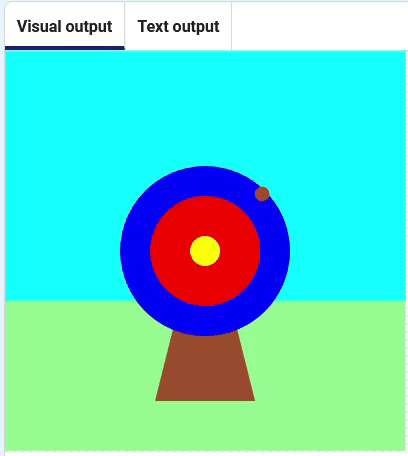

<h2 class="c-project-heading--task">Make the arrow move</h2>

--- task ---
➡️ Make the arrow appear at random positions on the screen.
--- /task ---

Change the `arrow_x`{:.language-python} and `arrow_y`{:.language-python} variables so that each position is chosen by random numbers.

--- code ---
---
language: python
line_numbers: true
line_number_start: 9
line_highlights: 11-12
---
# The shoot_arrow function goes here
def shoot_arrow():
    arrow_x = randint(100, 300)
    arrow_y = randint(100, 300)
    fill('sienna')
    circle(arrow_x, arrow_y, 15)

--- /code ---

**Test:** Click the **Run** button. You should see the arrow jump around the target.

