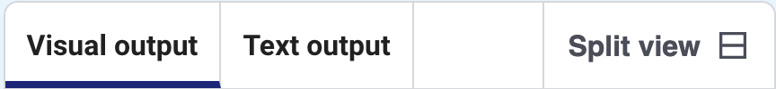
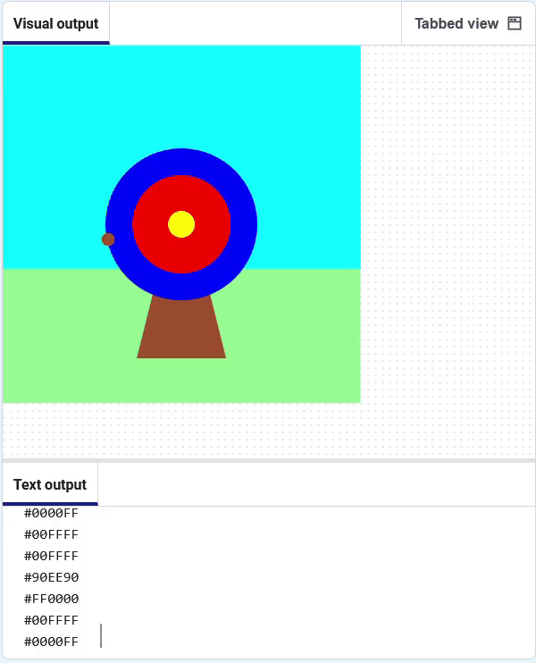

<h2 class="c-project-heading--task">Get the colour</h2>

--- task ---
➡️ Find out which colour the arrow is touching. 
--- /task ---

Add code to find the colour at the arrow's x, y coordinate, and store it in a variable called `hit_colour`. Print out the colour value.

--- code ---
---
language: python
line_numbers: true
line_number_start: 9
line_highlights: 11, 14, 15
---
# The shoot_arrow function goes here     
def shoot_arrow():
    global hit_colour  # Can be used in other functions  
    arrow_x = randint(100, 300)  
    arrow_y = randint(100, 300) 
    hit_colour = get(arrow_x, arrow_y).hex
    print(hit_colour)
    fill('sienna')
    circle(arrow_x, arrow_y, 15)

--- /code ---

**Test:** Stop your code from running, then switch to Split View before running your code again. Click the **Run** button. You should see the colours being printed in the **Text output**.

### Tip
Make sure you are in **Split view** so that you can see the **Text output** and the **Visual output**.

The codes you see printed are the hexidecimal representations of the colours.

