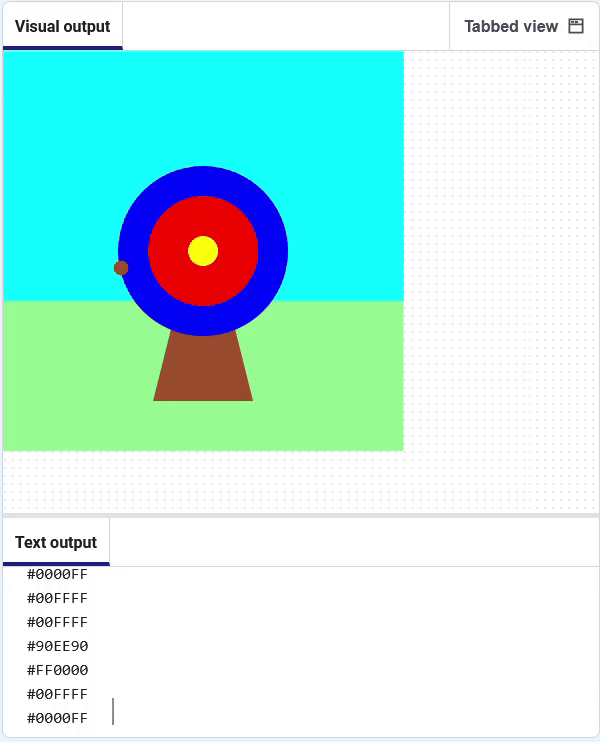

## Get the colour

➡️ Find out which colour the arrow is touching.

Add code to find the colour at the arrow's x, y coordinate, and store it in a variable called `hit_colour`. Print out the colour value.

```python line_numbers="true" line_number_start="9" line_highlights="11,14,15"
# The shoot_arrow function goes here     
def shoot_arrow():
    global hit_colour  # Can be used in other functions  
    arrow_x = randint(100, 300)  
    arrow_y = randint(100, 300) 
    hit_colour = get(arrow_x, arrow_y).hex
    print(hit_colour)
    fill('sienna')
    circle(arrow_x, arrow_y, 15)

```

## Now run your code

Stop your code from running, then switch to Split View before running your code again.




> [!TIP]
> Make sure you are in **Split view** so that you can see the **Text output** and the **Visual output**.
>
> The codes you see printed are the hexadecimal representations of the colours.

Click the **Run** button in **Split view** and check that colour codes are printed in **Text output**.
