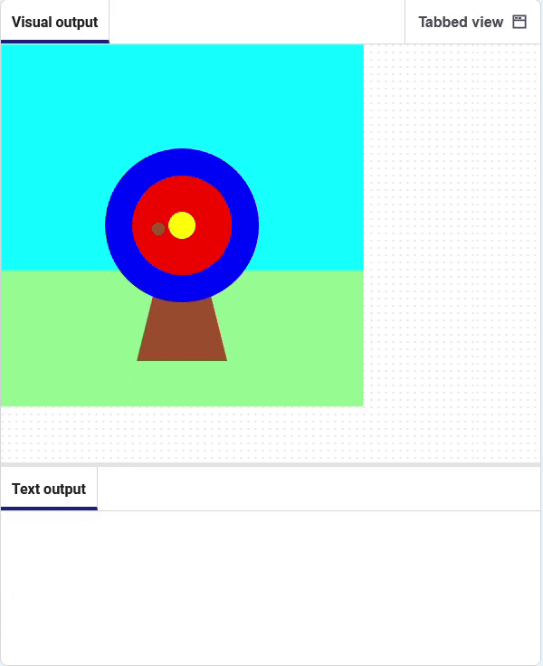

## Detect mouse clicks

➡️ Print a target emoji 🎯 when the mouse button is pressed.

## Step 1

Comment out the line that prints the colour.

```python line_numbers="true" line_number_start="14" line_highlights="15"
    hit_colour = get(arrow_x, arrow_y).hex
    # print(hit_colour)
    circle(arrow_x, arrow_y, 15)
```

## Step 2

Add code to print the target emoji 🎯 when the mouse is clicked.

```python line_numbers="true" line_number_start="5" line_highlights="6-7"
# The mouse_pressed function goes here    
def mouse_pressed():    
    print('🎯')
```

## Now run your code



> [!TIP]
> The `mouse_pressed()` function is automatically called by the `p5` library when the left mouse button is pressed.
